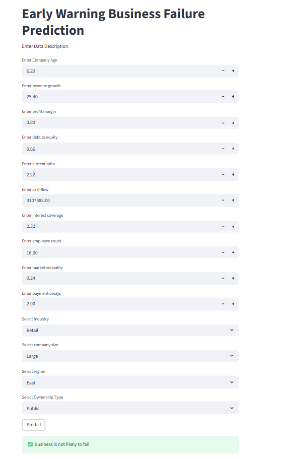
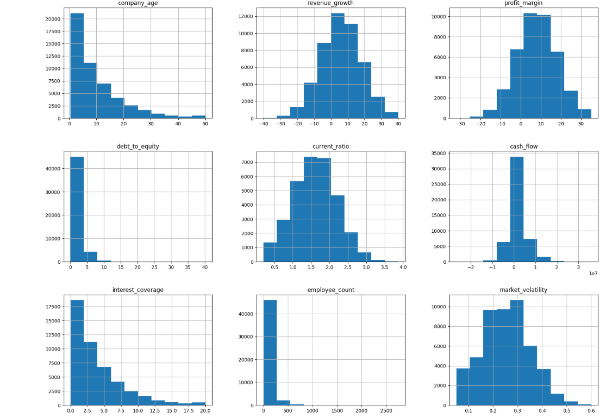
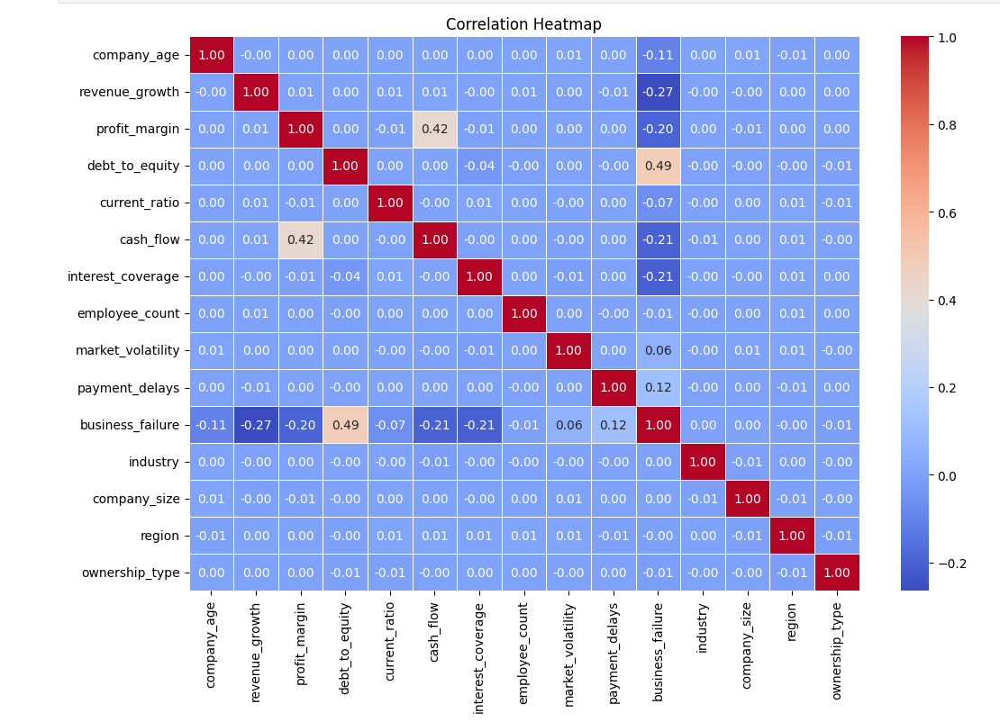
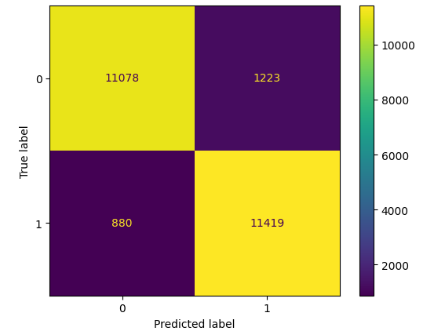

# Business Failure Prediction

## Overview

This project predicts business failure using financial and operational indicators through machine learning techniques.

## Key Features

- Data Cleaning and Preprocessing
- Missing Value Treatment
- Outlier Handling
- Label Encoding
- Feature Scaling
- Exploratory Data Analysis (EDA)
- SMOTE Class Balancing
- Machine Learning Model Training
- Hyperparameter Tuning using GridSearchCV

## Technologies Used

- Python
- Pandas
- NumPy
- Scikit-learn
- Matplotlib
- Seaborn
- XGBoost
- Streamlit

## Project Workflow

1. Data Collection
2. Data Preprocessing
3. Exploratory Data Analysis
4. Class Balancing using SMOTE
5. Model Training and Evaluation
6. Prediction Interface using Streamlit

## Results

- Successfully developed machine learning models for business failure prediction.
- Applied SMOTE to address class imbalance and improve model performance.
- Evaluated models using confusion matrix, accuracy score, precision, recall, and F1-score.
- Built a Streamlit application for real-time business failure prediction.
## Screenshots

### Streamlit Application

### Feature Distributions

### Correlation Heatmap

### Confusion Matrix

## Author

Veena P
